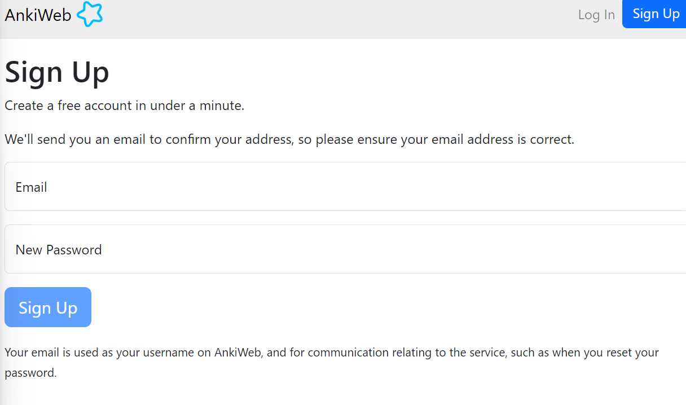
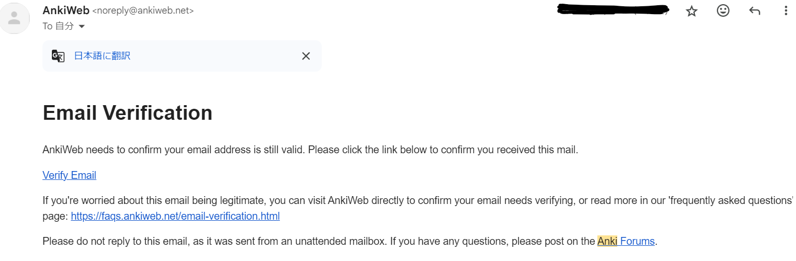
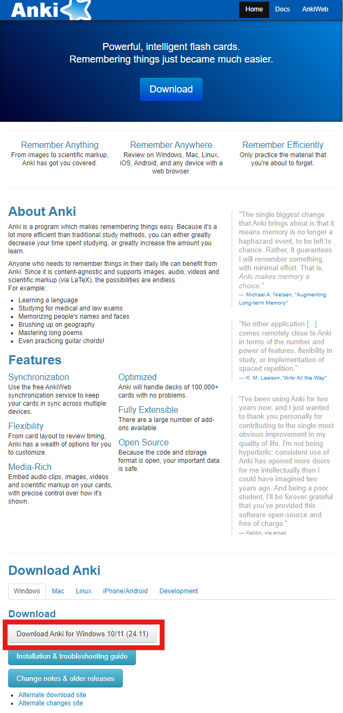
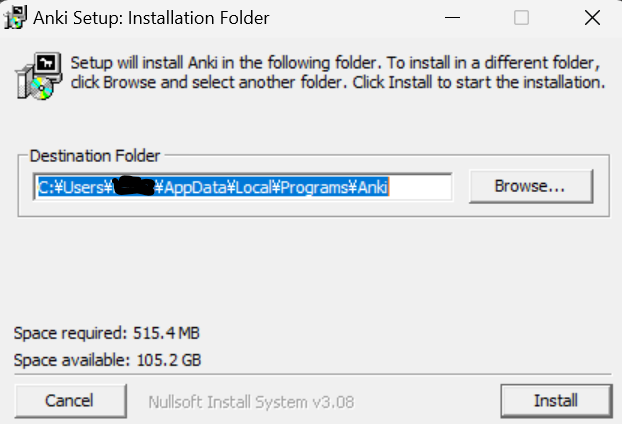
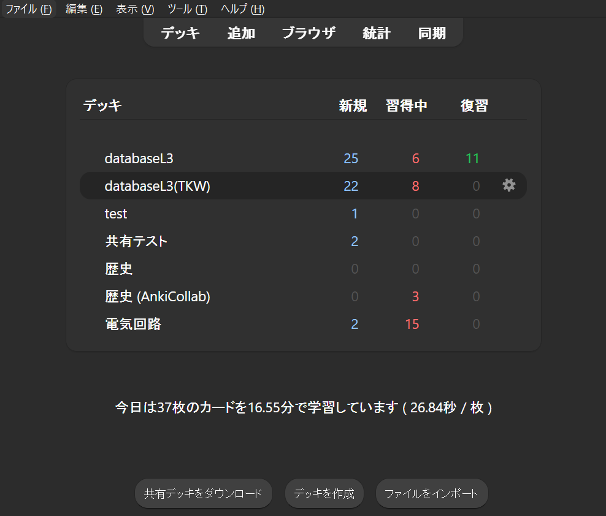

# アカウント作成
まず，自分のデバイス間で同期をするためのankiアカウントを作成
https://ankiweb.net/about
そしたら，右上の「`Sing Up`」ボタンでアカウントを作成する．
  
入力し終えると，登録したメールにアカウント承認メールがとどくので，
  
**Verrify Email**をクリックして，アカウントを承認，作成が完了
# ダウンロード
このリンクからダウンロード
https://apps.ankiweb.net/ 
  
赤枠のとこ

ダウンロード完了後，exeを開いて，インストール
  
そしたら，アカウントが作成されていれば最初アカウントログイン，作成していなかったら同期ボタンから，ログインをする．
｛画像ない｝
ログイン完了になると
https://ankiweb.net/decks
で自分のデッキ（フラッシュカード）が見れるようになる．
これで，セットアップ完了
# Ankiの使い方
  
これが，ホーム画面（デッキは本来ない）
## 機能一覧

### 基本
#### 上部のボタン
- デッキ
ホーム画面

- 追加
デッキを選択して，カードを追加

- ブラウザ
デッキを選択して，デッキの状態を確認

- 統計
文字通り

- 同期
文字通り

#### 下部のボタン
- 共有デッキのダウンロード
https://ankiweb.net/shared/decks から，インターネット上で全体公開されているものをダウンロードする．

- デッキを作成
新たに，フラッシュカードを作成する．

- ファイルのインポート
フラッシュカードを持ってくる．（Ankiで作成し，エクスポートしたフラッシュカードを読み込んだり，csv形式のものを読み込みことができる）

#### もっと上のボタン
`スタブ`

## 学習方法
デッキを選択して開くと，`学習開始`があるので，それを押すと問題が出る．
`解答を表示`を押すことで，答え合わせとなる．
そして，解答の評価をする．
これの繰り返しである．

